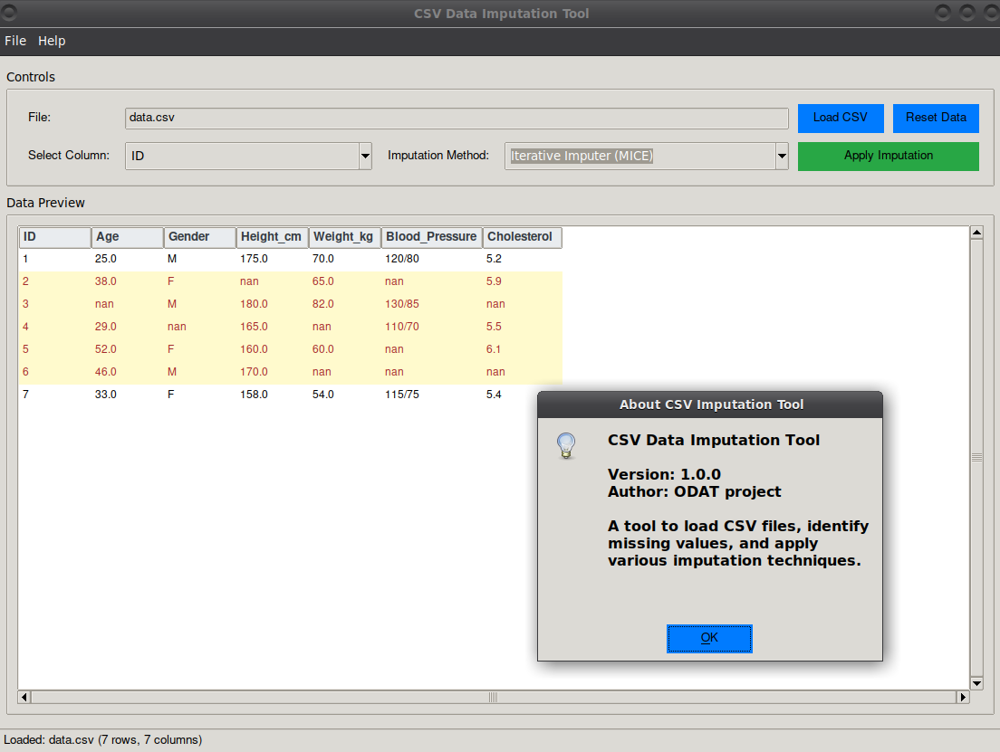

# Tool 10

This GUI-based application allows you to load a CSV file, identify missing values and apply various imputation techniques.

## Description

[Visit odat.info](https://odat.info)

## Screenshot

